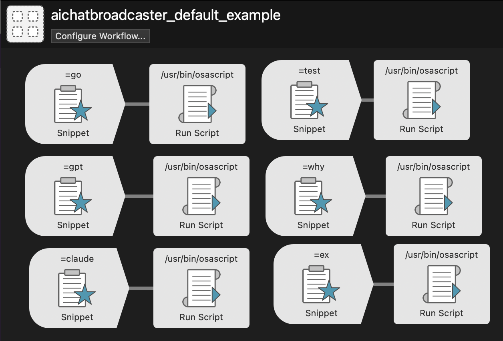

```
 █████╗ ██╗     ███████╗██████╗ ███████╗██████╗     
██╔══██╗██║     ██╔════╝██╔══██╗██╔════╝██╔══██╗    
███████║██║     █████╗  ██████╔╝█████╗  ██║  ██║    
██╔══██║██║     ██╔══╝  ██╔══██╗██╔══╝  ██║  ██║    
██║  ██║███████╗██║     ██║  ██║███████╗██████╔╝    
╚═╝  ╚═╝╚══════╝╚═╝     ╚═╝  ╚═╝╚══════╝╚═════╝     
                                                      
 ██████╗██╗  ██╗ █████╗ ████████╗██████╗  ██████╗ ████████╗
██╔════╝██║  ██║██╔══██╗╚══██╔══╝██╔══██╗██╔═══██╗╚══██╔══╝
██║     ███████║███████║   ██║   ██████╔╝██║   ██║   ██║   
██║     ██╔══██║██╔══██║   ██║   ██╔══██╗██║   ██║   ██║   
╚██████╗██║  ██║██║  ██║   ██║   ██████╔╝╚██████╔╝   ██║   
 ╚═════╝╚═╝  ╚═╝╚═╝  ╚═╝   ╚═╝   ╚═════╝  ╚═════╝    ╚═╝   
                                                             
██████╗ ██████╗  ██████╗  █████╗ ██████╗  ██████╗ █████╗ ███████╗████████╗███████╗██████╗ 
██╔══██╗██╔══██╗██╔═══██╗██╔══██╗██╔══██╗██╔════╝██╔══██╗██╔════╝╚══██╔══╝██╔════╝██╔══██╗
██████╔╝██████╔╝██║   ██║███████║██║  ██║██║     ███████║███████╗   ██║   █████╗  ██████╔╝
██╔══██╗██╔══██╗██║   ██║██╔══██║██║  ██║██║     ██╔══██║╚════██║   ██║   ██╔══╝  ██╔══██╗
██████╔╝██║  ██║╚██████╔╝██║  ██║██████╔╝╚██████╗██║  ██║███████║   ██║   ███████╗██║  ██║
╚═════╝ ╚═╝  ╚═╝ ╚═════╝ ╚═╝  ╚═╝╚═════╝  ╚═════╝╚═╝  ╚═╝╚══════╝   ╚═╝   ╚══════╝╚═╝  ╚═╝
```



# Alfred Workflow: AI Chatbot Broadcaster
*One-Click Automated Prompt Sender for Chrome AI Chatbots and Terminal AI Agents*

An AppleScript-based **Alfred Workflow** containing two simple scripts for batch-sending messages to AI chatbots on Chrome and AI agents in terminal. You can easily extend this workflow to dozens or hundreds of scripts using different triggers (hotkeys, keywords, etc.), freely combining custom prompts with various batch-sending targets to create flexible automation workflows. The two scripts provided are basic demonstrations of this concept.

**Basic Idea**:
1. First, copy some text to the clipboard
2. Use quick triggers (hotkeys, keyword input, etc.) to launch the script. If using keyword input, you can type keywords in almost any text input field to trigger the script
3. The script will automatically complete these operations: open Chrome browser (or terminal), find all qualifying AI chatbots and terminal agents, then send AI prompt template messages that users have pre-bound in workflow and snippets to all chatbots. This process is completed automatically by the computer, making it much faster than manual human operation

**Possible Use**: If you often need to send the same content to all qualifying chatbots in Chrome browser, or want a faster way to complete the process of — copying information, opening template lists, finding and copying prompt templates from the template list, opening a text box, combining clipboard information with prompt templates, copying, opening Chrome browser, finding chat boxes, pasting and sending, then finding the next chat box, pasting and sending, then... This process can be simplified by Alfred workflow to: copy information → hotkey → automatically trigger everything after that, it will automatically open Chrome browser and complete all remaining operations for you.

**Prerequisites**: macOS computer, Alfred with workflow and snippet capabilities, Chrome browser.

## Core Features

  - **Chrome Broadcasting**: The `aichatboardcaster-chrome.applescript` script can operate simultaneously on multiple AI tabs in Chrome (e.g., ChatGPT, Claude, Gemini).
  - **Terminal Control**: The `aichatboardcaster-terminal.applescript` script can send commands to your specified terminal app (e.g., Claude Code or Gemini CLI).
  - **Highly Customizable**: You can easily modify the script to target specific AI tools, configure various trigger methods (hotkeys, keywords, etc.), bind specific prompt templates to each script's keystroke section (using clipboard or any other available dynamic placeholders as dynamic variables), batch save and manage your prompt templates in Features → Snippets, and customize the entire automation workflow.
  - **Alfred Integration**: Completely based on and dependent on Alfred's workflow and snippet functionality.

## Prerequisites

1.  A **macOS** operating system.
2.  **Alfred** with the Powerpack.
3.  **Google Chrome** browser.
4.  Permissions granted in `System Settings > Privacy & Security > Automation` for Alfred to control Chrome, your terminal app, and System Events.
5.  **[IMPORTANT] Enable AppleScript in Chrome**:
      * In Google Chrome, click on the menu bar at the very top of the screen.
      * Navigate to **View → Developer → Allow JavaScript from Apple Events** and ensure this option is checked.

## Installation & Configuration

1.  **Import the Workflow**:

      * Download the `aichatboardcaster.alfredworkflow` file and double-click it to import it into Alfred. This workflow includes the `aichatboardcaster-chrome.applescript`, but you can completely customize various trigger-script connections flexibly using modified versions of `aichatboardcaster-chrome.applescript` and `aichatboardcaster-terminal.applescript`.

2.  **Configure Script Actions**:

      * In the Alfred workflow editor, create the "Run Script" actions you need.
      * Paste the content of `aichatboardcaster-chrome.applescript` into one action and connect it to a trigger (e.g., **keyword `=go`**, **hotkey `Cmd+Shift+C`**, or other triggers).
      * Paste the content of `aichatboardcaster-terminal.applescript` into another action and connect it to a different trigger (e.g., **keyword `=term`**, **hotkey `Cmd+Shift+T`**, or other triggers).
      * **Important Note**: Alfred workflows support multiple trigger types (hotkeys, keywords, file actions, etc.). Choose the trigger method that best suits your usage habits.
      * **Chain Scripts Together**: If you want one trigger to execute both scripts sequentially (e.g., broadcast the same message to Chrome AI chats first, then to terminal AI agents), connect your trigger to Script 1, then connect Script 1's output to Script 2. This way, the trigger will execute Script 1, and after Script 1 completes, it will automatically trigger Script 2. Theoretically, you could chain multiple scripts (Script 1 → Script 2 → Script 3...) to send multiple rounds of prompts consecutively, but this approach may be unstable since AI response generation speed might not keep up with the script's prompt sending speed. You could try modifying the scripts to add delays and wait longer between executions.

3.  **Configure Alfred Snippet Expansion** (Required):

      * Open Alfred Preferences → Features → Snippets.
      * **IMPORTANT**: Make sure to check "Automatically expand snippets by keyword" option in the Snippets settings.
      * Create a snippet with a keyword that differs from your workflow trigger (e.g., workflow uses hotkey trigger, snippet uses `-go` keyword).
      * **Snippet Content**: `{datetime:long}{clipboard}` — You can customize this to create custom prompt templates.
      * **Important**: The keystroke keyword in the script must match your snippet keyword, as the script uses keystroke to trigger snippet expansion.

## Usage

Usage depends on your configured trigger type:

**Method 1 - Hotkey Trigger**:
  - **Broadcast to Chrome**: Copy message to clipboard, then press your configured hotkey (e.g., `Cmd+Shift+C`).
  - **Send to Terminal**: Copy message to clipboard, then press your configured hotkey (e.g., `Cmd+Shift+T`).

**Method 2 - Keyword Trigger**:
  - **Broadcast to Chrome**: Copy message to clipboard, then type keyword (e.g., `=go`) in any application's text input field and press space. **Note: Must be typed in other applications' text input fields, not in Alfred's search window.**
  - **Send to Terminal**: Copy message to clipboard, then type keyword (e.g., `=term`) in any application's text input field and press space.

**Other Methods**:
  - Any other trigger methods available in Alfred workflows can work.

**Note on Input Methods**: All trigger methods may have input method issues with Snippet expansion. It's recommended to switch to English input method for stable triggering. I attempted to add functionality to force English input method switching in the script, but technical limitations prevented implementation. However, I found that shorter snippet keywords (e.g., `-go`) have better compatibility with non-English input methods.

**Note on Script Delays**: Local computer hardware performance and system configuration can affect the timing requirements for script execution. If you find the script executes too quickly causing operation failures, or too slowly affecting efficiency, you can modify the delay times in the script according to your specific situation. All `delay` parameters in the scripts are customizable and should be fine-tuned based on your Mac's performance.

## Customize Target AI Tools

You can modify the script content to add or remove AI tools by finding `if tabURL contains...` and modifying the matching information. Another important part is `keystroke "-go" -- CUSTOMIZABLE: Change to match your Alfred snippet keyword`. Modify the information after keystroke to match any keyword defined in Features → Snippets.

You can customize this list as needed, or leave only one to target a single platform.

## Repository Notes

The `Authors_Private_Storage` folder in this repository serves as the author's personal storage space. Since this is a niche project with limited visibility, the author uses it to store personal `.alfredworkflow` and `.alfredsnippets` files for convenience.

## License

This project is licensed under the MIT License.

-----

*Built for AI-powered productivity.*

-----

-----

# Alfred Workflow: AI Chatbot Broadcaster
*一键触发的自动给Chrome上的AI chatbot和终端的AI agent发送prompt的AI聊天prompt自动发送器*

一个基于AppleScript的**Alfred工作流**，包含两个简单的脚本，用于批量向Chrome上的AI chatbot和终端的AI agent发送消息。您完全可以利用Alfred工作流把这两个脚本扩展到几十上百个，并且使用不同的触发器（快捷键、关键字等）触发，将不同的自定义prompt和任何批量发送的目标自由组合，实现灵活的自动化流程。提供的两个脚本只是为了简单演示这个概念。

**基本想法**：
1. 首先复制一段文本到剪贴板
2. 使用快捷触发器（快捷键、关键字输入等）来启动脚本。如果使用关键字输入，您可以在几乎任何能输入文本的地方输入关键词，全都能触发脚本
3. 脚本会自动完成这些操作：打开Chrome浏览器（或终端），寻找所有符合条件的AI chatbot和终端agent，然后给所有chatbot发送用户提前在workflow和snippet上绑定的AI prompt模版消息，这个过程是计算机自动完成的，所以比人类手动操作快得多

**可能的用途**：如果您经常需要向Chrome浏览器所有符合条件的chatbot发送相同的内容，或者希望用更快的方式完成——复制信息、打开模版列表，从模版列表中寻找和复制prompt模版、打开一个文本框，把剪切板信息和prompt模版相结合，复制，打开Chrome浏览器，找到聊天框，黏贴发送，然后找下一个聊天框，黏贴发送，然后...这个过程可以被Alfred工作流简化为：复制信息 → 快捷键 → 自动触发之后所有的一切，它会为你自动打开Chrome浏览器完成一切其余操作。

**前置条件**：macOS电脑，能使用工作流和snippet的Alfred，Chrome浏览器。

## 核心功能

  - **Chrome广播**: `aichatboardcaster-chrome.applescript` 脚本可以同时在Chrome中的多个AI标签页上工作（如ChatGPT, Claude, Gemini等）。
  - **终端控制**: `aichatboardcaster-terminal.applescript` 脚本可以将指令发送到您指定的终端应用（Claude Code or Gemini CLI)”）。
  - **高度可定制**: 您可以轻松修改脚本，决定目标AI工具，配置各种触发方式（快捷键、关键字等），给每个脚本的keystroke部分绑定特定的prompt模版（以剪切板或任何其他可以使用的dynamic placeholder作为动态变量），以及在你的Features → Snippets栏目里批量保存和管理你的prompt模版，以及定制整个自动化工作流程。
  - **Alfred集成**: 完全基于和依赖Alfred的工作流和snippet功能。

## 使用前提

1.  **macOS** 操作系统。
2.  **Alfred** 并激活Powerpack功能。
3.  **Google Chrome** 浏览器。
4.  在“系统设置 \> 隐私与安全性 \> 自动化”中授予Alfred控制Chrome、终端以及System Events的权限。
5.  **【重要】开启Chrome的AppleScript权限**:
      * 在Chrome中，点击屏幕最上方的菜单栏。
      * 转到 **查看 → 开发者 → 允许 Apple 事件中的 JavaScript**，并确保该选项已被勾选。

## 安装与配置

1.  **导入工作流**:

      * 下载 `aichatboardcaster.alfredworkflow` 文件并双击导入到Alfred中。这个工作流只有aichatboardcaster-chrome.applescript，但是完全可以用aichatboardcaster-chrome.applescript和aichatboardcaster-terminal.applescript的各种修改版本灵活自定义大量的触发器-脚本连接

2.  **配置脚本动作**:

      * 在Alfred工作流编辑器中，创建您需要的"Run Script"动作。
      * 将 `aichatboardcaster-chrome.applescript` 的内容粘贴到一个动作中，并为其绑定一个触发器（例如，**关键字 `=go`**、**快捷键 `Cmd+Shift+C`**、或其他触发器）。
      * 将 `aichatboardcaster-terminal.applescript` 的内容粘贴到另一个动作中，并为其绑定另一个触发器（例如，**关键字 `=term`**、**快捷键 `Cmd+Shift+T`**、或其他触发器）。
      * **重要提示**: Alfred工作流支持多种触发器类型（快捷键、关键字、文件操作等），您可以根据使用习惯自由选择最适合的触发方式。
      * **脚本串联执行**: 如果你希望让触发器触发两个脚本，例如你想让同一个模版消息在Chrome上的每个AI聊天框先广播一遍，然后给终端的AI agent又广播一遍，那么在Alfred工作流中，你应该让触发器连接脚本1，脚本1连接脚本2，这样触发器触发脚本1，然后脚本1执行完毕之后触发脚本2。如果在工作流中让触发器触发一个脚本，然后在工作流中将脚本1连上脚本2，脚本2连上脚本3... 理论可以实现让脚本发送完一轮prompt，紧接着开始在另一轮发送下一个prompt，然后又开始发送下一个prompt，但是我认为这是不稳定的，因为AI生成内容的速度可能跟不上脚本发prompt的速度，不过你可以试试修改脚本增加延迟，等待的久一点。

3.  **配置Alfred Snippet展开**（必需）:

      * 打开 Alfred 设置 → Features → Snippets。
      * **重要**: 确保在Snippets设置中勾选"Automatically expand snippets by keyword"选项。
      * 创建一个Snippet，其关键词必须与工作流触发器不同（例如，工作流用快捷键触发，Snippet用 `-go` 关键词）。
      * **Snippet内容**: `{datetime:long}{clipboard}`——您可以任意修改这里的内容来创建自定义prompt模板。
      * **重要**: 脚本中的keystroke关键词必须与Snippet关键词一致，因为脚本通过keystroke触发Snippet展开功能。

## 使用方法

使用方法取决于您配置的触发器类型：

**方式一 - 快捷键触发**:
  - **广播到Chrome**: 复制消息到剪贴板，然后按设定的快捷键（如 `Cmd+Shift+C`）。
  - **发送到终端**: 复制消息到剪贴板，然后按设定的快捷键（如 `Cmd+Shift+T`）。

**方式二 - 关键字触发**:
  - **广播到Chrome**: 复制消息到剪贴板，然后在任何应用的文本输入框中输入关键字（如 `=go`）并按空格。**注意：需要在其他应用程序的文本输入框中输入，不能在Alfred的搜索窗口中输入。**
  - **发送到终端**: 复制消息到剪贴板，然后在任何应用的文本输入框中输入关键字（如 `=term`）并按空格。

**其他方法**:
  - 任何其他在workflow中可用的触发方式都可以工作。

**关于输入法的补充说明**: 所有触发方式在Snippet展开时都可能存在输入法问题，建议切换到英文输入法以确保触发稳定。我曾试图通过在脚本中增加强制切换英文输入法的功能，但由于技术限制未能实现。不过发现snippet关键词越短（例如`-go`），在中文输入法下的兼容性越好。

**关于脚本延迟的补充说明**: 本地电脑的硬件性能和系统配置会导致脚本执行的延迟需求不同。如果您发现脚本执行过快导致操作失败，或执行过慢影响效率，可以根据自身情况修改脚本中的延迟时间。脚本中的`delay`参数都是可以自定义调整的，建议根据您的Mac性能进行微调。

## 定制目标AI工具

你可以修改脚本内容来增加或减少AI工具，只需找到`if tabURL contains...`然后修改匹配信息。另一个重要的部分是`keystroke "-go" -- CUSTOMIZABLE: Change to match your Alfred snippet keyword`。修改keystroke后面的信息来和Features → Snippets中定好的任意keyword匹配。

## 仓库说明

本仓库中的`Authors_Private_Storage`文件夹是作者的私人存放点。由于这是一个冷门项目，作者懒得分公私，直接用这里存放个人的`.alfredworkflow`和`.alfredsnippets`文件。

## 许可

本项目采用 MIT 许可。

*为AI驱动的生产力而生*